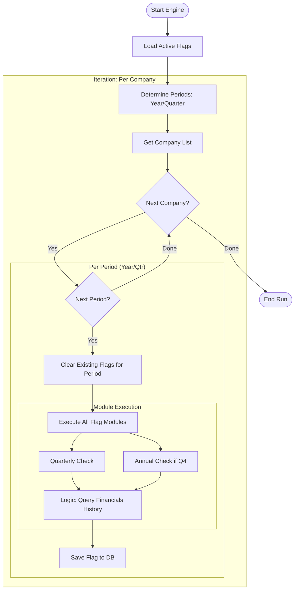

# Flagium: Flag Engine Architecture

The Flag Engine is the analytical core of Flagium. It transforms raw financial time-series data into actionable risk signals (Flags) using a pluggable strategy pattern.

## Workflow Diagram

## Core Components

### 1. The Orchestrator (`engine/runner.py`)
- **Period Management**: Calculates the current Fiscal Year and Quarter.
- **Idempotency**: Before running flags for a period, it deletes old records for that specific `(company_id, fiscal_year, fiscal_quarter)` to prevent duplicates.
- **Backfill**: Supports calculating flags for previous quarters using the `--backfill <N>` parameter.

### 2. Flag Modules (`flags/*.py`)
Each flag is a self-contained Python module following a standard interface:
- `SUPPORTS_QUARTERLY`: Boolean flag.
- `LOOKBACK`: Integer (How many historical periods are needed).
- `check(conn, company_id, ticker, ...)`: The core logic that returns a `dict` if a risk is detected, or `None` if clean.

### 3. Strategy Implementation
Flags are designed to be **deterministic**. They typically:
1. Query the `financials` table for the last `N` records.
2. Perform ratio analysis or growth calculations.
3. Compare results against hardcoded industry thresholds.

## Current Active Flags
- **OCF vs PAT**: Detects earnings quality (Operating Cash Flow < Profit After Tax).
- **Revenue-Debt Divergence**: Flags when debt grows faster than revenue.
- **Interest Coverage**: Flags if EBIT is insufficient to cover interest payments.
- **Profit Collapse**: Detects >50% YoY decline in net profit.
- **Negative FCF**: Flags consistent inability to generate Free Cash Flow.

## Operational Modes
- **Incremental**: Runs only for the latest completed quarter.
- **Backfill**: Re-calculates flags for the last 4-8 quarters to build a historical risk trend.
