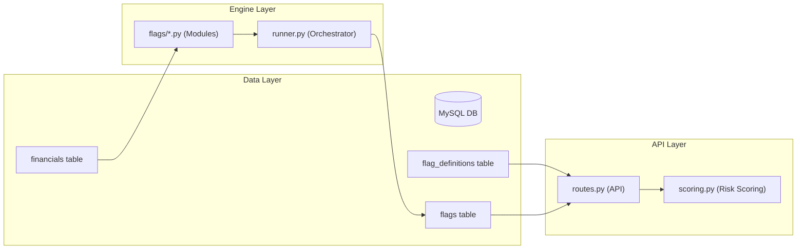
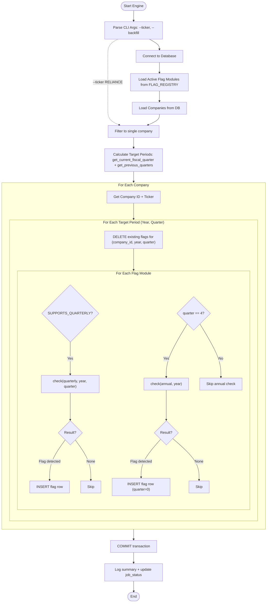
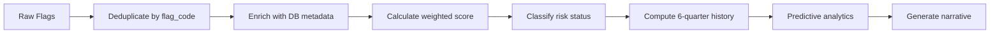

# Flag Engine Architecture

The Flag Engine is the analytical core of Flagium AI. It transforms raw financial time-series data into actionable risk signals (**Flags**) using a pluggable strategy pattern. Each flag module independently evaluates a company's financials against rule-based thresholds, and the scoring engine aggregates results into a composite risk profile.

---

## System Overview



---

## Engine Execution Flow



### Key Design Decisions

| Decision | Rationale |
|---|---|
| **Delete-before-insert** | Idempotent execution — re-running the engine for the same period never creates duplicates |
| **Annual flags only on Q4** | Prevents the same annual flag from being inserted 4 times per year |
| **Annual flags use `fiscal_quarter = 0`** | Distinguishes annual flags from quarterly flags in the database |
| **Single DB transaction** | All flag inserts are committed atomically after the full run completes |

---

## Indian Fiscal Year Mapping

Flagium uses the **Indian April–March fiscal year** convention. The engine maps calendar months to fiscal quarters:

| Calendar Months | Fiscal Quarter | Fiscal Year (Calendar 2025) |
|---|---|---|
| Apr – Jun | Q1 | FY 2026 |
| Jul – Sep | Q2 | FY 2026 |
| Oct – Dec | Q3 | FY 2026 |
| Jan – Mar | Q4 | FY 2025 |

The engine always targets the **latest completed quarter** (not the current in-progress quarter), ensuring all financial data has been filed and ingested before analysis.

```
get_current_fiscal_quarter()     → Returns (fiscal_year, fiscal_quarter)
get_previous_quarters(fy, q, N)  → Returns list of N (year, quarter) tuples going backwards
```

---

## Flag Module Interface

Every flag module in `flags/*.py` follows a strict contract:

```python
# Module-level constants
FLAG_CODE = "F1"                        # Unique identifier
FLAG_NAME = "OCF < PAT"                 # Human-readable name
SUPPORTS_QUARTERLY = True               # Whether check() handles quarterly periods
LOOKBACK = 3                            # Number of historical periods needed

# Core function
def check(conn, company_id, ticker, period_type="annual", year=None, quarter=None):
    """
    Returns dict if flag is triggered, None if clean.

    Return schema:
    {
        "flag_code": "F1",
        "flag_name": "OCF < PAT",
        "severity": "HIGH" | "MEDIUM" | "CRITICAL",
        "period_type": "annual" | "quarterly",
        "message": "Human-readable explanation",
        "details": { ... }            # JSON-serializable diagnostic data
    }
    """
```

### Active Flags

| Code | Name | Category | Weight | Supports Quarterly | Threshold |
|---|---|---|---|---|---|
| F1 | OCF < PAT | Earnings Quality | 4 | ✅ | OCF < PAT in 2 of last 3 periods |
| F2 | Negative FCF Streak | Governance | 4 | ❌ | Negative FCF for 3 consecutive years |
| F3 | Revenue-Debt Divergence | Balance Sheet Stress | 5 | ❌ | Revenue ↓ while Debt ↑ YoY |
| F4 | Low Interest Coverage | Balance Sheet Stress | 5 | ✅ | EBIT / Interest < 1.5 (critical), < 2.5 (medium) |
| F5 | Profit Collapse | Earnings Quality | 5 | ✅ | Net Profit drops > 50% YoY |

### Adding a New Flag

1. Create `flags/your_flag.py` implementing the interface above
2. Add an import and entry in `flags/__init__.py → FLAG_REGISTRY`
3. Add a row to the `flag_definitions` table via `db/seed_flags.py`

```python
# flags/__init__.py
FLAG_REGISTRY = [
    ocf_vs_pat,
    negative_fcf,
    revenue_debt_divergence,
    interest_coverage,
    profit_collapse,
    your_flag,          # ← Add here
]
```

---

## Risk Scoring Engine (`api/scoring.py`)

The scoring engine transforms raw flags into a composite risk profile for each company.

### Pipeline



### Score Calculation

```
For each unique flag:
    weight = 15   if impact_weight >= 5
    weight = 10   if impact_weight <  5

risk_score = min(100, sum_of_weights)
```

### Risk Classification

| Score Range | Status | Interpretation |
|---|---|---|
| 0 – 14 | **Stable** | No significant structural weaknesses |
| 15 – 34 | **Watchlist** | Early indicators worth monitoring |
| 35 – 59 | **Early Stress** | Emerging deterioration in key ratios |
| 60 – 100 | **Structural Deterioration** | Multiple systemic failures active |

### Category Scoring

Flags are grouped into three risk categories, each with a maximum contribution cap:

| Category | Max Score | Example Flags |
|---|---|---|
| Balance Sheet Stress | 25 | Interest Coverage, Revenue-Debt Divergence |
| Earnings Quality | 20 | OCF vs PAT, Profit Collapse |
| Governance | 20 | Negative FCF Streak |

The **Primary Driver** is the category with the highest accumulated weight at any given time.

### Predictive Analytics

The engine computes forward-looking risk metrics based on the 6-quarter score history:

```
slope           = (latest_score - oldest_score) / 5
volatility      = mean(|score[i] - score[i-1]|)
projected_base  = min(100, risk_score + slope × 1.5)
projected_stress = min(100, risk_score + slope × 2 + volatility × 2)
escalation_prob = capped percentage based on projected stress and slope direction
acceleration    = count of consecutive quarters where score increased
```

---

## Database Schema

### `flags` Table

```sql
CREATE TABLE flags (
    id              INT AUTO_INCREMENT PRIMARY KEY,
    company_id      INT NOT NULL,
    flag_code       VARCHAR(50) NOT NULL,
    flag_name       VARCHAR(100),
    severity        VARCHAR(20),          -- HIGH | MEDIUM | CRITICAL
    period_type     VARCHAR(20),          -- annual | quarterly
    fiscal_year     INT,
    fiscal_quarter  INT,                  -- 1-4 for quarterly, 0 for annual
    message         TEXT,
    details         JSON,
    created_at      TIMESTAMP DEFAULT CURRENT_TIMESTAMP,
    FOREIGN KEY (company_id) REFERENCES companies(id)
);
```

### `flag_definitions` Table

```sql
CREATE TABLE flag_definitions (
    flag_code       VARCHAR(50) PRIMARY KEY,
    flag_name       VARCHAR(100) NOT NULL,
    category        VARCHAR(50) NOT NULL,
    impact_weight   INT NOT NULL DEFAULT 5,
    description     TEXT,
    params          JSON,
    is_active       TINYINT(1) DEFAULT 1,
    created_at      TIMESTAMP DEFAULT CURRENT_TIMESTAMP,
    updated_at      TIMESTAMP DEFAULT CURRENT_TIMESTAMP ON UPDATE CURRENT_TIMESTAMP
) CHARACTER SET utf8mb4 COLLATE utf8mb4_unicode_ci;
```

---

## CLI Usage

```bash
# Run flags for all companies (latest quarter only)
python -m engine.runner

# Run for a specific company
python -m engine.runner --ticker RELIANCE

# Backfill last 8 quarters (rebuild historical risk profile)
python -m engine.runner --backfill 8

# Single company + backfill
python -m engine.runner --ticker TCS --backfill 4
```

---

## Structured Logging

The engine produces structured logs in CSV-like format for easy filtering and analysis:

```
Format: [Timestamp], [Level], [Ticker], [Message]
Output: stdout (INFO+) and logs/engine.log (DEBUG+)
```

**Example output:**

```
[2026-02-21 08:15:03], [INFO], [ENGINE], Running 5 flags on 750 companies for 1 quarter(s)
[2026-02-21 08:15:03], [INFO], [ENGINE], Target periods: [(2025, 3)]
[2026-02-21 08:15:04], [INFO], [RELIANCE], Analyzing RELIANCE
[2026-02-21 08:15:04], [INFO], [RELIANCE], F1 [FY2025 Q3]: OCF below PAT for 2 of last 3 quarters
[2026-02-21 08:15:05], [INFO], [TCS], Analyzing TCS
[2026-02-21 08:15:05], [DEBUG], [TCS], No flags detected for TCS
```

Each company gets its own namespaced logger (`flagium.engine.TICKER`) injected via a custom `_EngineTickerFilter`.

---

## Operational Modes

| Mode | Command | Behavior |
|---|---|---|
| **Incremental** | `python -m engine.runner` | Runs for latest completed quarter only. Fast (~1 min for 750 companies) |
| **Backfill** | `python -m engine.runner --backfill 8` | Rebuilds flag history for last N quarters. Used after adding new flags or fixing data |
| **Single Company** | `--ticker RELIANCE` | Debug/test a single company. Combinable with `--backfill` |
| **Production** | `pm2 start` via cron | Scheduled via PM2 process manager on production server |

---

## Architecture Principles

1. **Deterministic** — Given the same financial data, the engine always produces the same flags
2. **Idempotent** — Safe to re-run any number of times; delete-before-insert prevents duplicates
3. **Pluggable** — New flags require only a new module + registry entry, no orchestrator changes
4. **Atomic** — All flag inserts commit in a single transaction; partial runs are rolled back
5. **Observable** — Per-ticker structured logging makes it easy to trace any company's analysis
