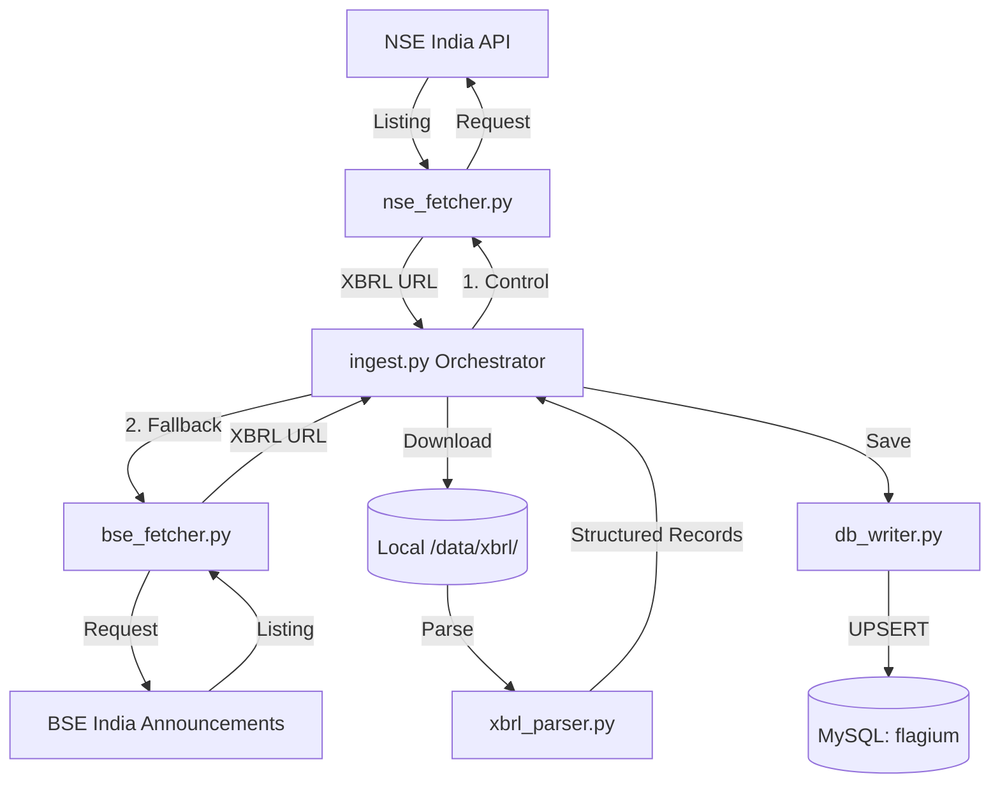

# Flagium: Ingestion Architecture

The ingestion module is responsible for bridging the gap between external exchange APIs (NSE/BSE) and our structured financial database.

## Data Flow Diagram (DFD)

## Functional Breakdown

### 1. The Discovery Phase (`nse_fetcher.py` / `bse_fetcher.py`)
- **NSE**: Primary source. Fetches basic company metadata and a JSON list of financial filings.
- **BSE Fallback**: Used if NSE is blocked or data is missing. Uses Playwright to scrape announcement feeds.

### 2. The Acquisition Phase (`ingest.py`)
- For every filing found, it looks for an **XBRL attachment** (XML format).
- Downloads the XML files to a local cache directory (`/data/xbrl`).
- Files are named using a `Ticker_Period_Hash.xml` scheme to prevent collisions.

### 3. The Processing Phase (`xbrl_parser.py`)
- Reads the XML file and extracts financial "Facts" based on standard taxonomies (GAAP/IFRS).
- Maps raw tags like `ProfitAfterTax` or `NetCashFlowFromOperatingActivities` into our internal database fields.

### 4. The Persistence Phase (`db_writer.py`)
- Uses a **Transactional Upsert** strategy.
- If a record for `(Company, Year, Quarter)` already exists, it updates the fields.
- This ensures that if we run a backfill for 2022, we don't duplicate existing 2024 data.

### 5. The Post-Process (`ingest.py`)
- **Cleanup**: Deletes local XBRL files upon successful DB commit to save disk space.
- **Heuristic Fix**: If "Annual Profit Before Tax" is missing from the annual filing, it tries to pull it from the corresponding Q4 (Full Year) filing.
